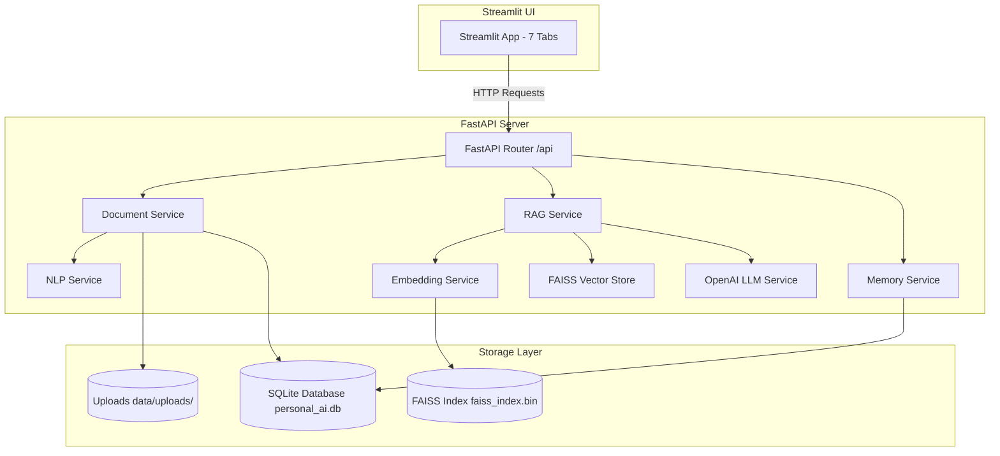

# PersonalAI — Personalized RAG Assistant

A complete, end-to-end working Generative AI portfolio project built specifically for a **Fresher Generative AI Engineer / Campus-Advanced Beginner** role.

PersonalAI enables users to upload custom documents (PDF, DOCX, TXT, Markdown) and chat with them using natural language. It integrates personalized candidate context, FAISS vector search, hallucination control guardrails, resume extraction, and job description skill-gap analysis.

[](https://www.python.org/)
[](https://fastapi.tiangolo.com/)
[](https://streamlit.io/)
[](https://github.com/facebookresearch/faiss)
[](https://platform.openai.com/)
[](LICENSE)

---

## 1. Problem Statement
Standard LLMs lack context regarding personal study notes, private project documentation, or candidate resumes. Uploading sensitive files to generic public models often leaks privacy or produces hallucinations. Freshers need an interview-friendly, non-overengineered RAG solution that demonstrates core GenAI mechanics clearly.

## 2. Solution
**PersonalAI** implements a clean Retrieval-Augmented Generation (RAG) architecture:
1. Extract and clean text from uploaded PDF/DOCX/TXT/MD files.
2. Chunk text using configurable size & overlap.
3. Compute token and character statistics using `tiktoken` and **Pandas**.
4. Index dense 1536-dimensional OpenAI embeddings into **FAISS**.
5. Retrieve top-$K$ chunks for user queries and inject candidate profile parameters into the system prompt for personalized, hallucination-controlled answers with verified source citations.

---

## 3. Core Features
- **💬 Personalized RAG Chat**: Chat with documents using FAISS semantic search and candidate profile context.
- **📚 Verified Source Citations**: Every RAG answer lists document name, chunk ID, page number, and expandable source text.
- **📁 Document Analytics (Pandas)**: Tabular statistics summarizing total documents, chunks, average chunk length, total words, and estimated tokens.
- **📄 Resume Analyzer**: Automatically parses education, core skills, technologies, and projects from candidate resumes.
- **🎯 Job Description Matcher**: Compares candidate profile and resume against target Job Descriptions, returning matching skills, missing skills, and interview preparation topics.
- **📜 SQLite Conversation Memory**: Sliding context window strategy preserving past conversation sessions without context window overflow.
- **✨ Document Summarizer**: Short, detailed, or key-points summary modes.
- **🛡️ Resilient Offline Fallback**: Deterministic vector & completion fallbacks for offline execution without active API keys.

---

## 4. Target Job Description Mapping

| HCLTech / GenAI JD Requirement | PersonalAI Project Implementation |
|---|---|
| **Python** | Python 3.11 object-oriented backend architecture |
| **NumPy** | Vector norm calculations, matrix operations, and cosine similarity |
| **Pandas** | Tabular document statistics, file metrics, and chunk length analytics |
| **NLP** | Text cleaning, whitespace normalization, and recursive chunking (`services/nlp_service.py`) |
| **Tokenization** | Token count estimation using `tiktoken` (cl100k_base) |
| **Embeddings** | OpenAI `text-embedding-3-small` dense vector representations |
| **Transformer Concepts** | Fresher documentation covering Self-Attention, Context Windows, and LLM mechanics (`docs/ai_concepts.md`) |
| **LangChain** | RAG prompt orchestration and document processing workflow |
| **Vector Database** | **FAISS** (IndexFlatIP) local vector storage & persistence |
| **SQL** | **SQLite** relational database with **SQLAlchemy** ORM (`users`, `documents`, `conversations`, `messages`) |
| **FastAPI** | REST API endpoints with interactive Swagger UI (`/docs`) |
| **Streamlit** | Multi-tab interactive frontend interface |
| **pytest** | Automated test suite verifying document ingestion, DB, FAISS, and APIs |
| **Git / GitHub** | Version controlled repository with `.gitignore` and clean structure |

---

## 5. Architecture Diagram



---

## 6. Project Structure

```
PersonalAI/
├── backend/
│   └── app/
│       ├── main.py                 # FastAPI app entry point & CORS
│       ├── config.py               # Pydantic Settings & environment vars
│       ├── database.py             # SQLAlchemy engine & session maker
│       │
│       ├── api/
│       │   ├── chat.py             # Chat API (/api/chats)
│       │   ├── documents.py        # Document upload, stats & deletion
│       │   ├── profile.py          # Candidate profile GET/PUT
│       │   ├── resume.py           # Resume analysis endpoint
│       │   └── jobs.py             # Job description matcher endpoint
│       │
│       ├── models/
│       │   ├── database_models.py  # SQLAlchemy models (User, Document, Conversation, Message)
│       │   └── domain_schemas.py   # Pydantic validation schemas
│       │
│       ├── services/
│       │   ├── document_service.py # Extraction (PDF, DOCX, TXT, MD) & Pandas stats
│       │   ├── nlp_service.py      # Text cleaning, tokenization (tiktoken) & chunking
│       │   ├── embedding_service.py# OpenAI embeddings & NumPy fallback
│       │   ├── vector_store.py     # FAISS storage, search & chunk deletion
│       │   ├── rag_service.py      # RAG pipeline & prompt construction
│       │   ├── llm_service.py      # OpenAI API integration
│       │   └── memory_service.py   # SQLite chat history & sliding context window
│       │
│       └── prompts/
│           └── prompts.py          # System prompts for RAG, Resume & Job Matching
│
├── frontend/
│   └── streamlit_app.py            # Streamlit frontend with 7 navigation tabs
│
├── data/
│   ├── uploads/                    # Document files directory
│   └── vector_store/               # Persisted FAISS binary & metadata
│
├── tests/                          # pytest test suite
│   ├── test_nlp_service.py
│   ├── test_document_service.py
│   ├── test_embedding_vectorstore.py
│   ├── test_database.py
│   ├── test_rag_service.py
│   └── test_api_endpoints.py
│
├── docs/
│   ├── architecture.md             # Visual diagrams & sequence flows
│   ├── ai_concepts.md              # Fresher guide on Transformers, Embeddings & RAG
│   └── interview_questions.md      # 30 detailed Q&As with code examples
│
├── .env.example
├── .gitignore
├── requirements.txt
├── README.md
└── Dockerfile
```

---

## 7. Installation & Setup

### Prerequisites
- Python 3.11 or higher
- Git

### 1. Clone Repository
```bash
git clone https://github.com/shivamgiri068/PersonalAI.git
cd PersonalAI
```

### 2. Set Up Environment
```bash
python3 -m venv venv
source venv/bin/activate   # On Windows: venv\Scripts\activate
pip install -r requirements.txt
```

### 3. Environment Variables
Copy `.env.example` to `.env` and add your OpenAI API key:
```bash
cp .env.example .env
```
Edit `.env`:
```env
OPENAI_API_KEY=your_actual_openai_api_key_here
OPENAI_MODEL=gpt-3.5-turbo
EMBEDDING_MODEL=text-embedding-3-small
```

---

## 8. Running the Project

### Option A: Running Backend & Frontend Separately

**Terminal 1: Start FastAPI Backend**
```bash
uvicorn backend.app.main:app --reload --port 8000
```
- API Health Check: `http://127.0.0.1:8000/`
- Interactive Swagger UI: `http://127.0.0.1:8000/docs`

**Terminal 2: Start Streamlit Frontend**
```bash
streamlit run frontend/streamlit_app.py
```
- App UI available at: `http://localhost:8501`

### Option B: Running via Docker
```bash
docker build -t personal-ai .
docker run -p 8000:8000 -p 8501:8501 --env-file .env personal-ai
```

---

## 9. Running Tests

Run the complete automated test suite using `pytest`:
```bash
python3 -m pytest tests/ -v
```
Output:
```text
tests/test_api_endpoints.py::test_root_health_check PASSED
tests/test_api_endpoints.py::test_openapi_docs PASSED
tests/test_api_endpoints.py::test_get_and_update_profile PASSED
tests/test_api_endpoints.py::test_list_documents_and_stats PASSED
tests/test_api_endpoints.py::test_chat_endpoint PASSED
tests/test_api_endpoints.py::test_job_analyzer_endpoint PASSED
tests/test_database.py::test_database_models_crud PASSED
tests/test_document_service.py::test_extract_text_file PASSED
tests/test_document_service.py::test_pandas_document_analytics PASSED
tests/test_embedding_vectorstore.py::test_embedding_generation_and_cosine_similarity PASSED
tests/test_embedding_vectorstore.py::test_faiss_vector_store_add_search_delete PASSED
tests/test_nlp_service.py::test_clean_text PASSED
tests/test_nlp_service.py::test_character_and_word_count PASSED
tests/test_nlp_service.py::test_token_count PASSED
tests/test_nlp_service.py::test_chunk_text PASSED
tests/test_rag_service.py::test_rag_query_execution PASSED
tests/test_rag_service.py::test_summarization_and_resume_analysis PASSED

======================= 17 passed in 4.31s =======================
```

---

## 10. Example Questions to Try

1. **Document Questions**:
   - *"What skills are mentioned in my resume?"*
   - *"Summarize section 3 of my project notes."*
   - *"What is my CGPA?"* (Tests hallucination control when data is missing).
2. **Personalized Questions**:
   - *"Suggest a GenAI project tailored to my profile."*
3. **Resume & Job Match**:
   - Paste a Job Description into the **Job Analyzer** tab to view matching vs missing skills.

---

## 11. GitHub Push Instructions

Execute the following commands to initialize and push this project to GitHub:

```bash
cd PersonalAI

# Initialize Git Repository
git init

# Add all project files
git add .

# Create initial commit
git commit -m "feat: Initial commit for PersonalAI — Personalized RAG Assistant"

# Rename branch to main
git branch -M main

# Add remote GitHub repository
git remote add origin https://github.com/shivamgiri068/PersonalAI.git

# Push to GitHub
git push -u origin main
```

---

## 12. Resume Bullet Points

Add these two truthful bullet points to your resume:

- **PersonalAI — Personalized RAG Assistant**: Engineered an end-to-end Retrieval-Augmented Generation (RAG) assistant using **Python, FastAPI, LangChain, FAISS, OpenAI API, SQLite, SQLAlchemy, Streamlit, NumPy, Pandas** to index custom documents (PDF, DOCX, TXT, MD) and deliver context-aware, personalized Q&A with strict hallucination control guardrails.
- **Vector Search & Analytics Pipeline**: Implemented recursive text chunking, token estimation via `tiktoken`, dense 1536-d vector embeddings in FAISS, Pandas document summary analytics, and SQLite conversation memory managing sliding context windows for lower latency.

---

## 13. What I Learned & Challenges Overcome

1. **Vector Index Management**: Learned how to construct and persist FAISS `IndexFlatIP` indices locally and handle chunk deletions cleanly without corrupting metadata maps.
2. **Context Guardrails**: Engineered system prompts with strict negative constraints to prevent LLM hallucinations when document context is missing.
3. **Memory Window Pruning**: Implemented sliding context window strategies in SQLite to retain session context while staying within token limits.

---

## 14. License

This project is open-source under the MIT License.
