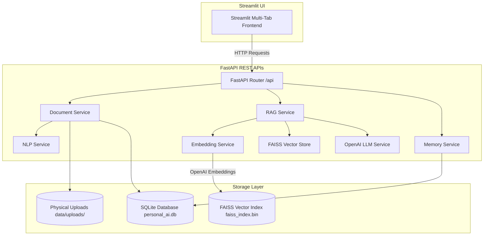
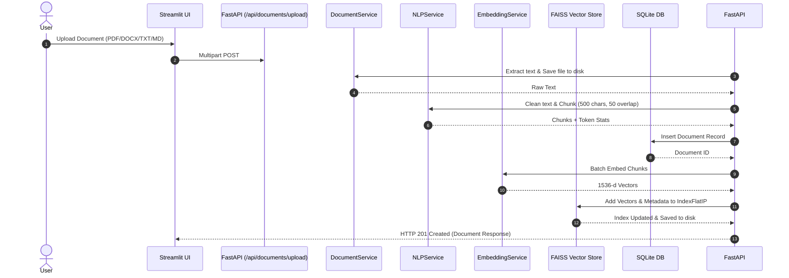
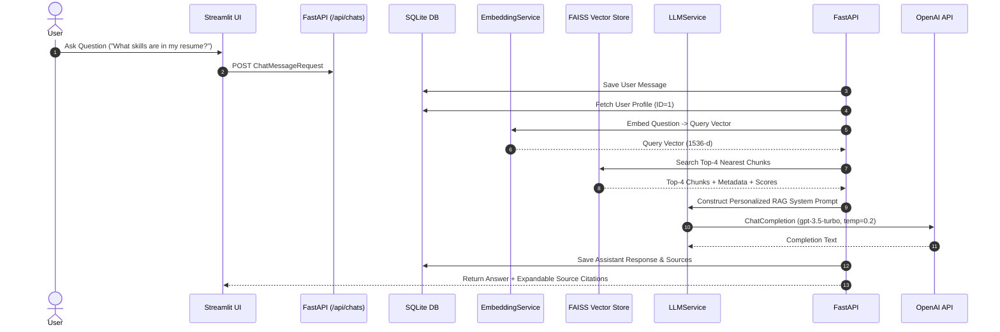
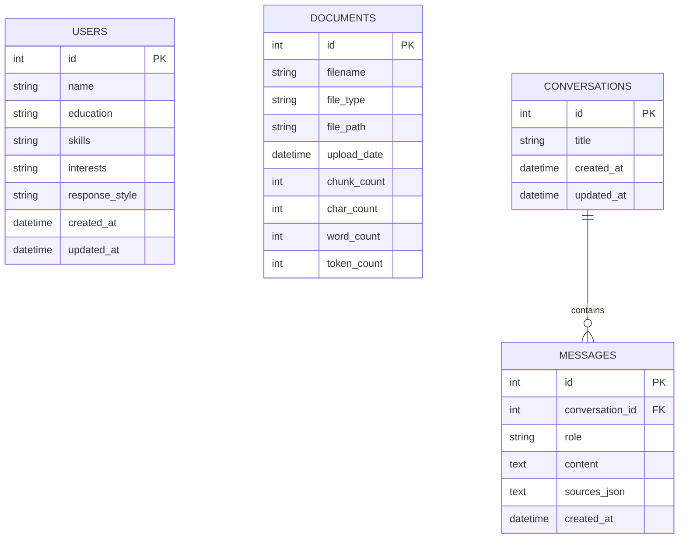

# System Architecture & Technical Specification

This document details the architectural design, component flow, database schemas, and data pipelines for **PersonalAI — Personalized RAG Assistant**.

---

## 1. High-Level System Architecture

---

## 2. Document Ingestion Pipeline

---

## 3. RAG Query Execution & Hallucination Guardrail Flow

---

## 4. Relational Database Schema (SQLite + SQLAlchemy)

